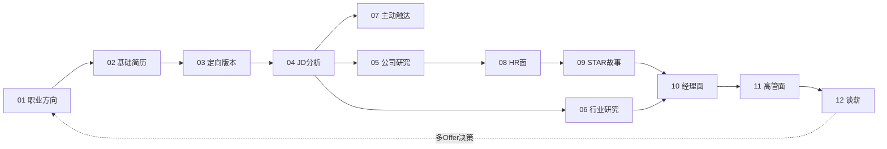

# Hireable

> From JD to Offer｜职场求职 AI 工具包

这是一套覆盖**完整求职旅程**的 12 个 AI Skill 文件：
从*找工作前期*的职业方向分析、简历搭建、岗位JD 解读、公司与行业研究准备、跟进HR/猎头/内推，*找工作中期* HR 面、经理面、高管终面，再到*最终的*薪资谈判。

**❓怎么用**：每个文件都是一个独立可用的"Skill"——复制全文粘贴给任意 AI 工具（Claude / ChatGPT / Gemini 等），再填写文末的空白输入模板，即可获得结构化的、可直接使用的求职输出。

**❓适用谁**：
- 想换行但是不知道现有技能该找什么行业/岗位？
- 想找工作但迟迟没开始改简历
- 有目标岗位/企业但是简历没有针对性
- 有清晰找工作目标，但是对系统性了解目标行业/市场/公司没有头绪
- 需要一个面试专家来梳理经历：STAR面试法则都知道，但是没用在自己的经历上
- 面了很多，但是offer很少，不清楚不同轮的面试侧重点

> **命名说明**：文件标题中的 **Step** 表示它在求职旅程中的步骤顺序；文件之间互相引用时使用 **Skill**（如"参见 Skill 04"），指代文件本身的能力单元。两者编号一致，`Step 04 = Skill 04 = 04_jd_analysis.md`。

---

### 🗺️ 求职旅程

## 💡 12 个 Skill 索引 

| Step | 文件 | 一句话说明 | 求职阶段 |
|------|------|-----------|---------|
| 01 | [`01_career_direction.md`](skills/01_career_direction.md) | 职业方向分析：能力盘点 → 方向比较 → Offer 决策（三阶段） | 定方向 |
| 02 | [`02_resume_builder.md`](skills/02_resume_builder.md) | 基础简历诊断与重建（含排版与终稿生成） | 做简历 |
| 03 | [`03_resume_version.md`](skills/03_resume_version.md) | 按岗位大类生成 2-3 个定向投递版本 | 做简历 |
| 04 | [`04_jd_analysis.md`](skills/04_jd_analysis.md) | JD 岗位解读、匹配度评估与面试考察点预测 | 投递 |
| 05 | [`05_company_research.md`](skills/05_company_research.md) | 公司背景研究，转化为面试可用的业务表达 | 面试准备 |
| 06 | [`06_market_research.md`](skills/06_market_research.md) | 行业/细分市场认知，转化为面试可说的市场洞察 | 面试准备 |
| 07 | [`07_referral_outreach.md`](skills/07_referral_outreach.md) | 内推 / 猎头 / HR 三类对象的主动触达与跟进管理 | 投递 |
| 08 | [`08_interview_hr.md`](skills/08_interview_hr.md) | HR 初面：自我介绍、离职原因、动机、规划与反问 | 面试 |
| 09 | [`09_interview_star_stories.md`](skills/09_interview_star_stories.md) | STAR 行为面试故事库（含失败案例与受众适配） | 面试 |
| 10 | [`10_interview_manager.md`](skills/10_interview_manager.md) | 直属经理（HM）轮的业务能力对话准备 | 面试 |
| 11 | [`11_interview_senior.md`](skills/11_interview_senior.md) | Director/VP 及以上高管轮面试准备 | 面试 |
| 12 | [`12_salary_negotiation.md`](skills/12_salary_negotiation.md) | 薪资结构拆解、期望锚定与 Offer 谈判 | Offer |

### 📌 怎么开始？（快速自测）

- 还不确定要找什么方向 → **从 01 开始**
- 方向明确，简历还没着落或没信心 → **02 → 03**
- 简历就绪，看到心动的 JD → **04，然后用 07 提高曝光**
- 拿到面试邀约 → **05 + 06 做功课，按轮次进 08 / 09 / 10 / 11**
- 被问薪资或拿到 Offer → **12**；多个 Offer 纠结选哪个 → **01 的阶段三**

---

## 🕹️ 使用方法（工具无关）

1. **选文件**：按上面的自测找到当前需要的 Skill，打开对应 `.md` 文件
2. **粘贴**：复制文件全文，粘贴到你使用的 AI 工具对话框中
3. **填输入**：复制文件末尾的"空白输入模板"，填写后发送
4. **跟随交互**：每个 Skill 内置执行规则——输入不全时 AI 会先提问而不是乱编；按模块逐步输出

各工具的细微差别：

| 工具 | 用法 |
|------|------|
| **Claude** | 直接粘贴使用；也可将文件存为 Project knowledge 或自定义 Skill 重复调用 |
| **ChatGPT** | 直接粘贴使用；高频使用可将文件设为自定义 GPT 的 Instructions |
| **Gemini** | 直接粘贴使用；可配合 Gem 功能保存 |
| 其他工具 | 只要支持长文本输入即可，文件均为纯 Markdown |

---

## 使用前必读的四条声明

1. **示例背景声明**：全部 12 个文件的使用示例基于**同一位虚构候选人**（外企 B2B 产品/市场背景的中层职场人）。框架本身职能无关——市场、运营、销售、职能岗均可使用，请将示例中的行业与职责替换为你自己的情况；个别 PM 特定的清单（如 Skill 07 的猎头信息表）已标注替换方法。
2. **数字虚构声明**：示例中所有公司名、人名、薪资和业绩数字（如 `€XM`、`1XXX+`、`XXk`）均为匿名化占位或虚构演示，不指向任何真实主体。
3. **真实性原则**：本工具包只优化**真实经历**的表达，不编造事实——简历和面试中的所有数字必须经得起追问。AI 生成的市场数据、薪资区间仅供参考，使用前请通过猎头、行业人脉、公开数据自行核实。
4. **时效声明**：内容基于 2026 年中的求职市场认知整理，市场数据类内容会随时间过时，使用时请以最新信息为准。

---

## Roadmap

- **v1.1（计划）**：面试复盘框架——把"面了没过"转化为下次改进的结构化方法（并入 Skill 09 或新增 Skill 13）
- 欢迎通过 Issue 反馈非 PM 职能的使用体验，帮助提升通用性

## License

© 2026 JaclynD

本作品采用 [CC BY-NC-ND 4.0](https://creativecommons.org/licenses/by-nc-nd/4.0/deed.zh-hans) 许可协议发布：可自由分享（须完整、未经修改地转载），但须**署名原作者**、**不得用于商业目的**、**不得分发改编后的版本**。你可以为自己使用而修改内容，但不得将修改后的版本公开发布或传播。完整协议见 [LICENSE](LICENSE)。
